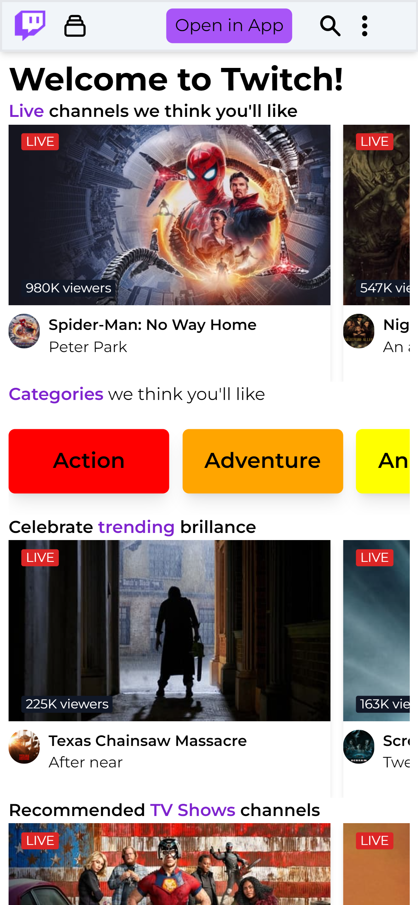
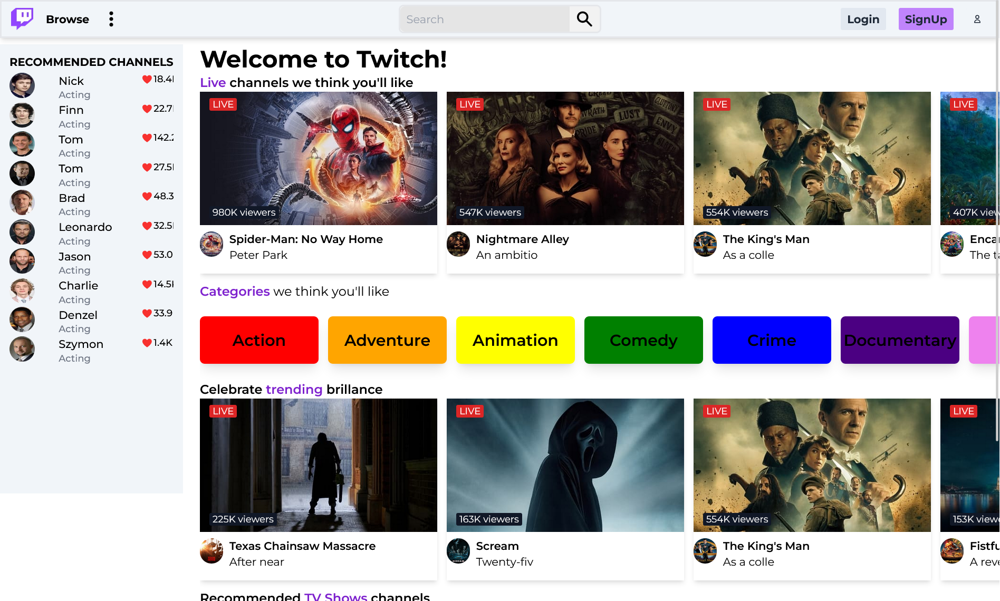

# Twitch.tv Clone build with Next.js & TailwindCSS

This project is build with [`Tailwind CSS`](https://tailwindcss.com/) [`(v3.0)`](https://tailwindcss.com/blog/tailwindcss-v3) with Next.js.

## Preview

Preview the example live on [Twitch Tv](https://twitch-tv-clone.vercel.app/):

[](https://twitch-tv-clone.vercel.app/)

## Deployed on vercel

[`Deployed on vercel`](https://twitch-tv-clone.vercel.app/)

I have Deployed on [Vercel](https://vercel.com?utm_source=github&utm_medium=readme&utm_campaign=next-example):


## How I started with this

Started with Execute [`create-next-app`](https://github.com/vercel/next.js/tree/canary/packages/create-next-app) with [npm](https://docs.npmjs.com/cli/init) or [Yarn](https://yarnpkg.com/lang/en/docs/cli/create/) to bootstrap the example:

```bash
npx create-next-app -e with-tailwindcss twitchclone

# or
yarn create next-app --e with-tailwindcss twitchclone
```

# twitch.tv-clone Screenshots

<!-- adding files fromn public folder -->

<div>

</div>

<div>
    
</div>